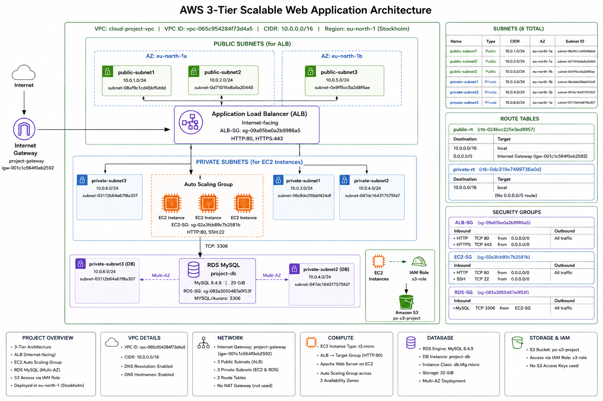

# AWS Automated Security Audit Scanner

An automated AWS security auditing project that scans AWS resources for common security configuration issues, generates a structured security report, and delivers the report through email.

The scanner is implemented using AWS Lambda and is triggered automatically through Amazon EventBridge Scheduler. Findings are logged in Amazon CloudWatch and the completed audit report is sent through Amazon SNS.

## Architecture



## AWS Resources Used

| AWS Service | Purpose |
|---|---|
| **AWS Lambda** | Runs the security scanning logic |
| **Amazon EventBridge Scheduler** | Automatically triggers the Lambda security scan |
| **Amazon S3** | Scanned for public-access configuration |
| **AWS IAM** | Scanned for IAM user MFA and root-account MFA status |
| **Amazon EC2 / Security Groups** | Security groups are inspected for exposed SSH and unrestricted traffic |
| **Amazon RDS** | Checked for publicly accessible database instances |
| **Amazon CloudWatch** | Stores Lambda execution logs and the generated security report |
| **Amazon SNS** | Sends the completed security audit report through email |

## Project Workflow

EventBridge Scheduler triggers the Lambda function according to the configured schedule.

Lambda then performs the following security checks:

1. S3 public-access configuration
2. IAM user MFA status
3. Root account MFA status
4. Security Group inbound rules
5. RDS public accessibility

The findings are collected and classified by severity. Lambda then generates a consolidated security report, logs the report to CloudWatch, and publishes it to an SNS topic for email delivery.

## Security Checks

### 1. S3 Public Access Check

The Lambda function retrieves the S3 buckets in the account and checks the bucket-level Public Access Block configuration.

The following settings are checked:

- `BlockPublicAcls`
- `IgnorePublicAcls`
- `BlockPublicPolicy`
- `RestrictPublicBuckets`

A bucket is reported as passed when all four protections are enabled.

### 2. IAM User MFA Check

The scanner retrieves the IAM users in the account and checks whether each user has an MFA device configured.

The result is reported as:

- MFA enabled
- MFA not enabled

Users without MFA are classified as **HIGH** risk.

### 3. Root Account MFA Check

The scanner generates and retrieves the AWS IAM credential report.

The report is decoded and processed to determine whether MFA is enabled for the root account.

The result is reported as:

- Root Account MFA enabled
- Root Account MFA not enabled

A root account without MFA is classified as **CRITICAL**.

### 4. Security Group Audit

The scanner retrieves the security groups in the AWS account and examines their inbound rules.

It identifies two specific internet-exposed configurations.

**SSH exposed to the internet**

```text
Source: 0.0.0.0/0
Port: 22
````

This is classified as **HIGH** risk.

**All traffic exposed to the internet**

```text
Source: 0.0.0.0/0
Protocol: All
```

This is classified as **CRITICAL**.

The report includes the affected security group and the associated security finding.

### 5. RDS Public Access Check

The scanner checks the RDS instances in the selected AWS region.

For each database instance, the `PubliclyAccessible` property is examined.

Possible results are:

* RDS publicly accessible → **HIGH**
* RDS not publicly accessible → **PASS**
* No RDS instances found → **INFORMATION**

The RDS check is still performed even when no database instances are currently deployed.

## Finding Classification

Each finding generated by the scanner is assigned a severity:

| Severity           | Meaning                                            |
| ------------------ | -------------------------------------------------- |
| 🔴 **CRITICAL**    | Severe security exposure                           |
| 🟠 **HIGH**        | Significant security risk                          |
| 🟡 **WARNING**     | Check could not be completed or requires attention |
| 🟢 **PASS**        | Security check passed                              |
| 🔵 **INFORMATION** | Informational result                               |

Each finding contains:

* Severity
* AWS service
* Resource
* Finding message

## Automated Security Report

After completing the security checks, Lambda generates a consolidated audit report containing:

* AWS region
* Scan time
* Scanner information
* Resources checked
* Result summary
* Critical findings
* High-risk findings
* Warnings
* Passed checks
* Informational findings
* Recommended actions

The report also provides recommended actions such as:

* Enable MFA for IAM users without MFA
* Restrict SSH access to trusted IP ranges
* Remove unrestricted Security Group rules
* Review unused or unnecessary Security Groups
* Review RDS public accessibility when databases are deployed

## EventBridge Scheduling

Amazon EventBridge Scheduler is configured to trigger the Lambda security scanner automatically.

The configured schedule runs the security scan on a daily basis, allowing the audit to be performed without manually invoking the Lambda function.

## CloudWatch Logging

Amazon CloudWatch Logs records the Lambda execution and security audit output.

The logs contain:

* Security check results
* Detected findings
* Severity information
* Generated security report
* SNS delivery confirmation

This provides visibility into each scanner execution.

## SNS Email Notification

Amazon SNS is configured with a security-alert topic and an email subscription.

After Lambda completes the scan, the generated report is published to the SNS topic.

```text
Lambda
   |
   v
Security Report
   |
   v
Amazon SNS Topic
   |
   v
Email Notification
```

The email contains the complete AWS security audit, including the scan summary, severity counts, individual findings, and recommended actions.

## Project Code

The repository contains the main development stages and the final integrated scanner.

| File                        | Purpose                                                                                                                                                                                                              |
| --------------------------- | -------------------------------------------------------------------------------------------------------------------------------------------------------------------------------------------------------------------- |
| `check_s3_public_access.py` | Checks S3 bucket public-access protection                                                                                                                                                                            |
| `s3_and_iam_mfa_check.py`   | Checks S3 public access and IAM user MFA                                                                                                                                                                             |
| `sg_risk_check.py`          | Checks Security Groups for internet-exposed SSH and unrestricted traffic                                                                                                                                             |
| `rds_risk_check.py`         | Checks RDS instances for public accessibility                                                                                                                                                                        |
| `scan_report.py`            | Final integrated scanner that performs the S3, IAM MFA, root MFA, Security Group and RDS checks, classifies findings, generates the security report, logs the output to CloudWatch, and sends the report through SNS |
e you're removing the numbers from the actual files, use those exact five names in the `code/` folder so the README matches.
```
